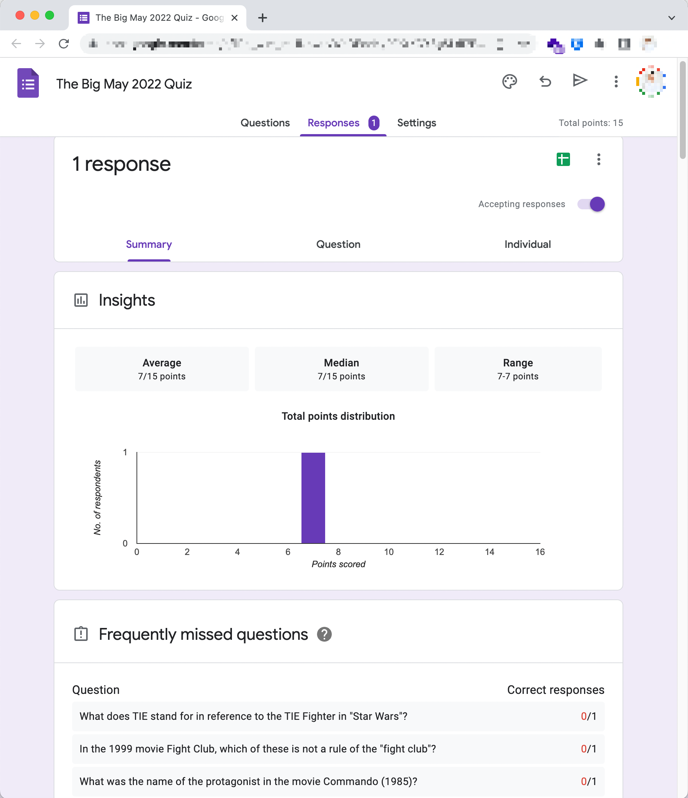

# Quiz Master 2022

[](https://quiz-master-2022.herokuapp.com/)

[Link to Live Site](https://quiz-master-2022.herokuapp.com/)


## Table of Contents
- [Introduction](#introduction)
- [User Stories](#user-stories)
- [UX  ](#ux)
  * [Typography](#typography)
  * [Wireframes](#wireframes)
- [Features ](#features)
  * [Existing Features](#existing-features)
    + [Main Menu](#main-menu)
    + [Play Quick Quiz Round](#play-quick-quiz-round)
    + [Create Custom Quiz](#create-custom-quiz)
    + [Create Google Form Quiz](#create-google-form-quiz)
    + [Help](#help)
    + [Quiz Classes](#quiz-classes)
    + [Google Drive Utility Menu](#google-drive-utility-menu)
  * [Features Left to Implement](#features-left-to-implement)
- [Technologies Used](#technologies-used)
- [External Python Packages Used](#external-python-packages-used)
- [Testing ](#testing)
  * [User Story Testing](#user-story-testing)
  * [Challenges Faced](#challenges-faced)
  * [Code Validation](#code-validation)
- [Deployment](#deployment)
- [Credits ](#credits)
  * [Content ](#content)
  * [Media](#media)
  * [Acknowledgements](#acknowledgements)

## Introduction

The project is a Python command line application which can create and play quiz games using an consisting of several rounds based on the user's desired configuration.

The user can play along in the terminal, or export a quiz to Google Forms where they can share it with friends where they will be automatically graded.

I was frustrated by the difficulties faced writing and grading a virtual table quiz and was inspired to make an application to automate the process.


## User Stories

- As a first time user, I need instructions on how to use the applications so I can use it.

- As a user, I want to be able to play a quick quiz round without choosing any settings.

- As a quiz enthusiast I want to be able to build custom quizzes based on different categories.

- As a user running a virtual quiz, I want to be able to create a custom quiz to share and play with my friends.


## 


## UX  

I used Lucid Chart to plan the flow of the application before coding.


To make the application easy to navigate, numbers are used for most responses unless the user needs to type a name for their Quiz.

The user can quit to the main menu at any stage, and validation is used on all input to check inputs and ensure the application doesn't crash.

The terminal screen is regularly cleared to ensure the terminal doesn't get cluttered and confuse the user between input prompts.

Coloured text was used for correct/incorrect answer messages and warnings.


### Typography

I chose Courier New (or other monospace font as fallback) to match the text of the Python Terminal, and as it is one of the most commonly available web-safe fonts.


### Wireframes

I altered the Code Institute Python Terminal template to provide a new colour scheme, center the terminal and add a link to the GitHub repository.


## Features 


### Existing Features

***

#### Main Menu

```
Main Menu
_________

Please choose from the following:

(1) Play Quick Quiz Round
(2) Create Custom Quiz
(3) Create a Google Form Quiz
(4) Help

Press Enter to confirm your selection. 
```

The user is presented with four options and can select where to navigate to by entering the corresponding number.

Validation is used to ensure they only enter a valid option.

At any point after this menu, the user can enter `Quit` or `Q` to return back to the Main Menu.


#### Play Quick Quiz Round

The application creates a short quiz of 8 General Knowledge questions for the user to play immediately.


#### Create Custom Quiz

The user can select custom options for a quiz, and play through the quiz.


#### Create Google Form Quiz

The user can create a custom quiz, and they will receive a Google Form link where they can play the Quiz and send it to friends for the purposes of running a virtual table quiz.

Optionally, they can add their Google Account e-mail address to be added as a owner of the form, so they can see all the responses/results and edit the form if desired.


#### Help

This screen provides further information on using the application, with a detailed description of the different menu options.


#### Quiz Classes

I wanted to write `create_quiz.py` to make it as reusable as possible, so it could easily be used in other Quiz projects.

I took the data returned from the Open Trivia Database, and created Python objects using classes.

A Game Object contains 1 or more Round objects, which in turn contain 1 or more Question objects.

Each of the objects are constructed using an `__init__` method similar to below:

```python
class Game:
    def __init__(self, quiz_title, num_rounds, num_qs, categories, difficulty):
        self.quiz_title = quiz_title
        self.num_rounds = num_rounds
        self.num_questions = num_qs
        self.categories = categories
        self.difficulty = difficulty

        self.rounds = [Round(x+1, self.num_questions, self.categories[x],
                             self.difficulty) for x in range(self.num_rounds)]

```

***

#### Google Drive Utility Menu

- When building the project, I needed a way to use the Google Drive API to manage the forms created. I built a simple file management tool, and implemented it as a secret menu option from the Main Menu.

- To access the Google Drive Utility, you enter 999 on the Main Menu and are then prompted for a password.

- I implemented the administrator password similar to the API keys, storing it in a variable in the `creds.json` file which wasn't pushed to Heroku. In the Heroku project settings I stored it as a Config Var, ensuring it is never publicly exposed.

- As the Utility is only available to an administrator, I have included screenshots below.

<details>
<summary>Screenshots of Hidden Google Drive Utility</summary>


</details>

***


### Features Left to Implement

- The project could be built out to include a choice of sources for the Quiz Questions. I came across several interesting Quiz APIs and designed the Quiz objects to be reusable.


## Technologies Used

- [Python](https://www.python.org/)
- [pip](https://pip.pypa.io/en/stable/) for installing Python packages.
- [Git](https://git-scm.com/) for version control.
- [GitHub](https://github.com/) for storing the repository online during development.
- GitHub Projects was invaluable throughout the project and helped me keep track of things to do and bugs to fix - you can see [the project's board here](https://github.com/users/davidindub/projects/3).
- [GitPod](https://gitpod.io/) as a cloud based IDE.
- [Google Forms API](https://developers.google.com/forms) and [Google Drive API](https://developers.google.com/drive) for creating and sharing the generated Google Forms.
- [Balsamiq](https://balsamiq.com/wireframes/) for wireframing the browser view.
- [Google Chrome](https://www.google.com/intl/en_ie/chrome/), [Mozilla Firefox](https://www.mozilla.org/en-US/firefox/new/) and [Safari](https://www.apple.com/safari/) for testing on macOS Monterey.
- [Lucid Chart](https://lucid.app/) for making flow charts.

## External Python Packages Used

- [termcolor](https://pypi.org/project/termcolor/) for colored terminal text.
- [art](https://github.com/sepandhaghighi/art) - ASCII art library for ASCII text.
- [google-auth](https://pypi.org/project/google-auth/) & [google.oauth2](https://google-auth.readthedocs.io/en/stable/reference/google.oauth2.html) for authenticating with Google APIs.
- [apiclient](https://pypi.org/project/apiclient/) for API error handling.
- [email-validator](https://pypi.org/project/email-validator/) for validating the user's e-mail address if they want the Google Form Quiz shared with their Google Account.


## Testing 

I performed manual testing continuously as the application was being developed.

I attempted many possible inputs that could disrupt the application. I used the package `email-validator` to validate the user's e-mail address should they want the Google Form shared with them. For instances where a "Y" or "N" was expected, I accepted "YES" or "NO" and lowercase versions of all.
While Loops were used to ask the user for input until an accepted value was entered (or the user quit by entering "Q", "QUIT" or lowercase versions of either). 

I used the `pprint` package at some stages of development to more easily see objects I was printing to the terminal, but it wasn't used in the final application.

I used test JSON quiz data stored in a variable to test the Google Forms creation functions as I was building them.

The application requires the Open Trivia API to be available for all its features so if the API cannot be reached the application will quit with a message asking the user to try again later, and providing the URL of the Open Trivia API so they can check its status.

<details>
<summary>Screenshots with test data</summary>


</details>

I initiated Game objects based on test data which was later removed, as well as relying on API calls.


The [GitHub Issues](https://github.com/davidindub/quiz-master/issues) page of the repository was invaluable for tracking bugs found, and closing the issues when fixed. More of the bugs and issues discovered while developing can be seen here.

I deployed on Heroku early so I could see the final input as it differs from the terminal in my development environment.
I had to limit the amount of text displayed at any time to prevent a scroll appearing, such as on the help screen and listing the available categories.

As the categories list was too long for the deployed project's terminal, I created a variable `NUM_OF_CATS_TO_DISPLAY` and set it to 17 which limits the number displayed, hiding some of the more niche categories.


### User Story Testing


<details>

<summary>As a first time user, I need instructions on how to use the applications so I can use it.</summary>

1. At the Main Menu, I see the Help option, number 4.
2. I input `4` to select it and press Enter, and a screen displays with a description of the application, and explanations of the other Main Menu Options.
3. A Link to GitHub is also provided which takes me to this README.


**Result:** Pass ✅
</details>

<details>

<summary>As a user, I want to be able to play a quick quiz round without choosing any settings.</summary>


**Result:** Pass ✅
</details>

<details>

<summary>As a quiz enthusiast I want to be able to build custom quizzes based on different categories.</summary>

1. At the Main Menu, I see the first option is 'Play Quick Quiz Round'
2. I input `1` to select it and press Enter, and I am immediately playing a short quiz of 8 questions.
3. At the end of the quiz my result is displayed, and I can press any key to return to the Main Menu.


**Result:** Pass ✅
</details>

<details>

<summary>As a user running a virtual quiz, I want to be able to create a custom quiz to share and play with my friends.</summary>

1. At the Main Menu, I see the option to Create a Google Form Quiz.
2. I input `3` to select it and press Enter, and I am taken to the Quiz setup.
3. I am asked about the settings I want for my quiz; the quiz name, number of rounds, number of questions, categories, and difficulty of the questions.
4. My settings are shown to me for confirmation, if I made a mistake or changed my mind I can restart. I press `Y` to confirm.
5. A URL to the Google Form is shared with me.
6. I input my e-mail address and the form is shared with me by email. Now I can see the responses as they come in and run my virtual quiz.





**Result:** Pass ✅
</details>


### Challenges Faced

- The [Google Forms API](https://developers.google.com/forms) was only released in March 2022, the month before I started building the project and I was excited to use it, but unlike other products like Google Sheets, there was are no Python Packages released yet to simplify using the Forms API.
- I had to build the project using just the documentation and there was a lack of any examples of the Forms API in use in a Python project yet.
- I think there's great potential for a Google Forms API Package, and it's a project I would like to work on in future.

- I faced difficulties with the encoding of the data from the API and escape characters appearing when I passed the data to Google Forms. I used `urllib.parse.urlparse` to parse the Quiz API data. Using square bracket notation to access the properties of the Quiz/Round/Game objects for the Google Form creation was introducing encoding errors, so I created methods on the objects that return the properties.

<details>
<summary>Screenshots with encoding issues</summary>


</details>

### Code Validation

All the files pass PEP8 Validation, which I checked both in the development environment and on [PEP8 online](http://pep8online.com/).

I used `# noqa` on line 66 of `create_quiz.py` ignore a line length warning on a long URL for an API call.


<details>
<summary>PEP8 Online Validation - run.py</summary>


</details>

<details>
<summary>PEP8 Online Validation - helpers.py</summary>


</details>

<details>
<summary>PEP8 Online Validation - play-quiz.py</summary>


</details>

<details>
<summary>PEP8 Online Validation - create-quiz.py</summary>


</details>

<details>
<summary>PEP8 Online Validation - create-gform.py</summary>


</details>

<details>
<summary>PEP8 Online Validation - create-gform-items.py</summary>


</details>

<details>
<summary>PEP8 Online Validation - gdrive-utility.py</summary>


</details>


***


## Deployment

Due to a recent [security breach](https://status.heroku.com/incidents/2413) of Heroku OAuth Tokens, GitHub actions deployment to Heroku was disabled.

The required Procfile for Heroku was included in the Code Institute Python Essentials Template (see [Content](#credits) section)

I instead deployed to Heroku using the Heroku CLI with the following steps
    - Create a new App in the Heroku web dashboard named 'quiz-master-2022'
    - In the Heroku Dashboard Settings, under Config Vars - add the contents of the `creds.json` file which wasn't pushed to a variable called `CREDS`
    - Under Buildpacks, add Python and Nodejs and click save.
    - run `heroku login -i` in the command line directory of the project
    - Enter my Heroku account login details
    - run `heroku git:remote -a quiz-master-2022` to set git remote heroku to https://git.heroku.com/quiz-master-2022.git
    - run `git push heroku main` to push to Heroku


In order to make a local copy of this project, you can clone it. In your IDE Terminal, type the following command to clone my repository:

- `git clone https://github.com/davidindub/quiz-master.git`


Alternatively, if using Gitpod, you can click below to create your own workspace using this repository.

[](https://gitpod.io/#https://github.com/davidindub/quiz-master)

***

After cloning or opening the repository in Gitpod, you will need to:

1. Create your own `creds.json` with the Google API details in this format:

```json
{
    "type": "",
    "project_id": "",
    "private_key_id": "",
    "private_key": "",
    "client_email": "",
    "client_id": "",
    "auth_uri": "",
    "token_uri": "",
    "auth_provider_x509_cert_url": "",
    "client_x509_cert_url": ""
  }
```

2. See [Develop on Google Workspace](https://developers.google.com/workspace/guides/get-started) for steps on creating a Google Cloud project and creating access credentials.

You will need to enable the Google Forms and Google Drive APIs for your project.

3. Run `pip3 install -r requirements.txt` to install required Python packages.

## Credits 

### Content 

- I began with the [Code Institute Python Essentials](https://github.com/Code-Institute-Org/python-essentials-template) template and customised the the HTML & CSS. The template allows the Python application to run in the browser using a terminal build with [Node.js](https://nodejs.org/en/).
- [Open Trivia Database](https://opentdb.com/) for the quiz questions.
- The code for the custom greeting based on the time of day I originally wrote for another application, [Coffee Calculator](https://github.com/davidindub/coffee-calculator/blob/main/greeting.py)
- [Google Forms API](https://developers.google.com/forms) and [Google Drive API](https://developers.google.com/drive) documentation for their quickstart guides on using the APIs.
- [Stack Overflow: Clear terminal in Python](https://stackoverflow.com/questions/2084508/clear-terminal-in-python) for the code to clear the terminal screen.


### Media


### Acknowledgements

- Thank you to my CI Mentor [Tim Nelson](https://github.com/TravelTimN) for his help and suggestions.
- Thanks to my partner David for his constant support on my journey to a new career.